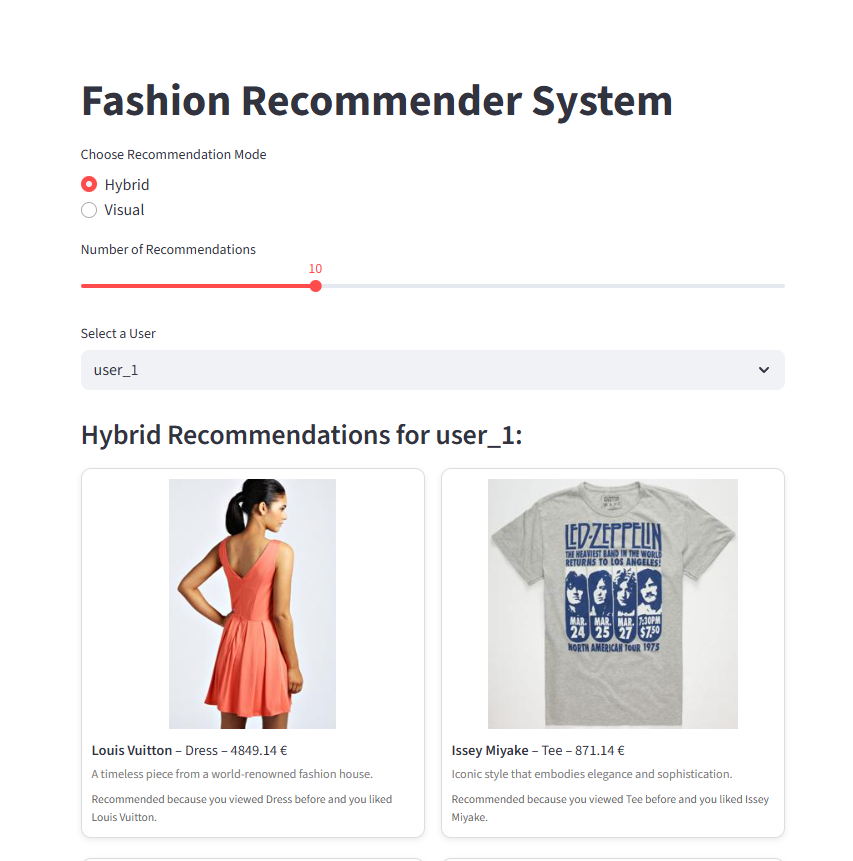
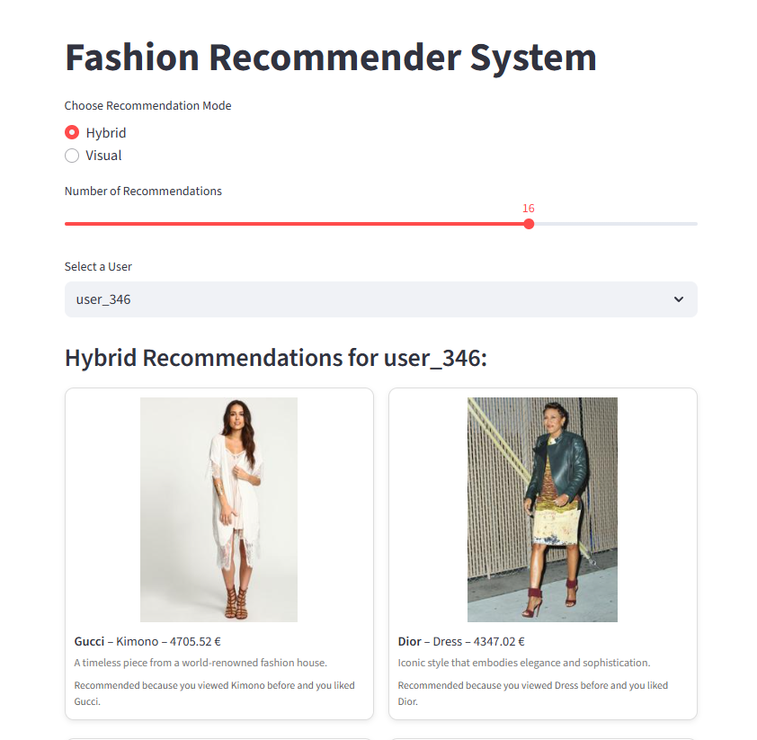
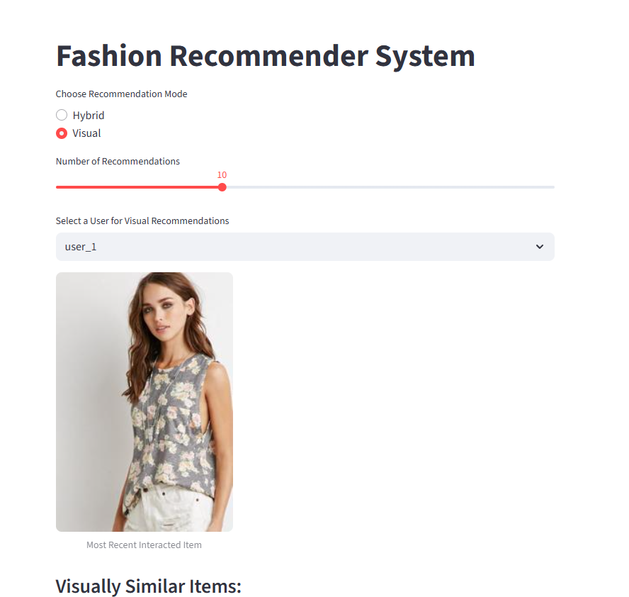
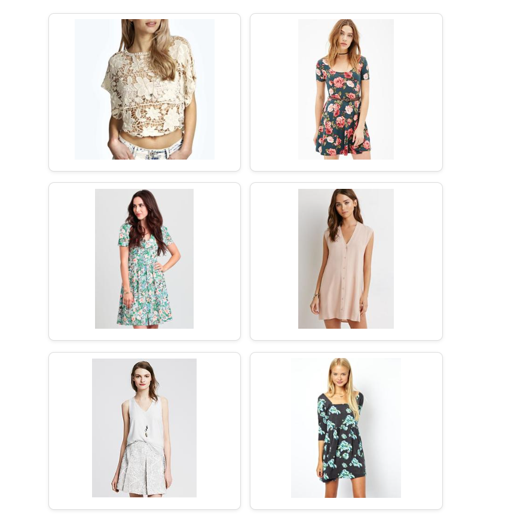

# 👗 Fashion Recommender System

This project is a portfolio demonstration of different recommender system approaches applied to fashion data.  
It shows how collaborative filtering, content-based filtering, hybrid recommendation, and visual similarity search can be combined or compared in an interactive UI.

---

## Quickstart

### 1. Clone the repository
```bash
git clone https://github.com/axelsgit/fashion-recommender.git
cd fashion-recommender
````

### 2. Install dependencies

```bash
pip install -r requirements.txt
```

### 3. Generate data and run the demo app 

* Product CSVs (`products.csv`, `users.csv`, `user_interactions.csv`) can be **replicated** by running:

  ```bash
  python generate_data.py
  ```
* Visual features (`features.pkl`, `imagefiles.pkl`) can be **generated** by running:

  ```bash
  python -c "from visual_recommender import build_feature_index_from_catalog; build_feature_index_from_catalog('products.csv')"
  ```

* **Expose a REST API for recommendations** by running:

```bash
python -m uvicorn app:app --reload
```

* Demo UI can be **started** by running:

```bash
streamlit run demo.py
```

---

## 📂 Project Structure

```
fashion-recommender/
│
├── app.py                       # Optional FastAPI backend
├── demo.py                      # Main Streamlit demo app
├── collaborative_recommender.py # Collaborative filtering
├── content_recommender.py        # Content-based filtering
├── hybrid_recommender.py         # Hybrid recommender logic
├── visual_recommender.py         # Visual similarity recommender
├── explain_recommendation.py     # Text explanations for recs
├── requirements.txt              # Dependencies
├── README.md                     # Project description
└── data/                         # CSVs, PKLs (not included here)
```

---

## Data: DeepFashion

The recommender system uses the **DeepFashion dataset** for product images:
[DeepFashion Dataset](https://mmlab.ie.cuhk.edu.hk/projects/DeepFashion.html)

Notes:

* A manual column `category_id` was added to `list_category_cloth.txt` to simplify processing.

---

## ⚡ Features

* **Collaborative Filtering** (user-item interactions)
* **Content-Based Filtering** (metadata: category, description, etc.)
* **Hybrid Model** (combining collaborative + content-based)
* **Visual Similarity** (using ResNet50 feature embeddings)

The **Streamlit app** lets you:

* Select a user and see **hybrid recommendations**
* Select a user and see **visual recommendations** (most recent interaction → visually similar items)
* Select the **number of recommended items** to be displayed (5-20)

---

## 🖼️ Demo Screenshots

Hybrid recommendations example:


Hybrid recommendations example for different user and number of recommendations:


Visual similarity search example:



---

## Disclaimers

1. **Hybrid vs Visual Separation**
   For this demo, the hybrid recommender (collaborative + content-based filtering) is kept **separate** from the visual recommender.
   In production, these could be blended into one model, but here they are shown separately for **clarity and interpretability**.

2. **DeepFashion Data**
   Source: [DeepFashion Dataset](https://mmlab.ie.cuhk.edu.hk/projects/DeepFashion.html).
   A manual `category_id` column was added to `list_category_cloth.txt`.

3. **Brand Names**
   Brand names are used for **demonstration purposes only**.

   * This project is **not affiliated with, endorsed by, or representative of any real-world brands**.
   * Publicly available DeepFashion images were used.
   * Real-world brand names were **randomly assigned** to items.
   * There is **no bias** in assignment.

---

👨‍💻 **Author:** Axel Heussner
📧 Contact: [www.linkedin.com/in/axel-heussner](https://www.linkedin.com/in/axel-heussner)

```


